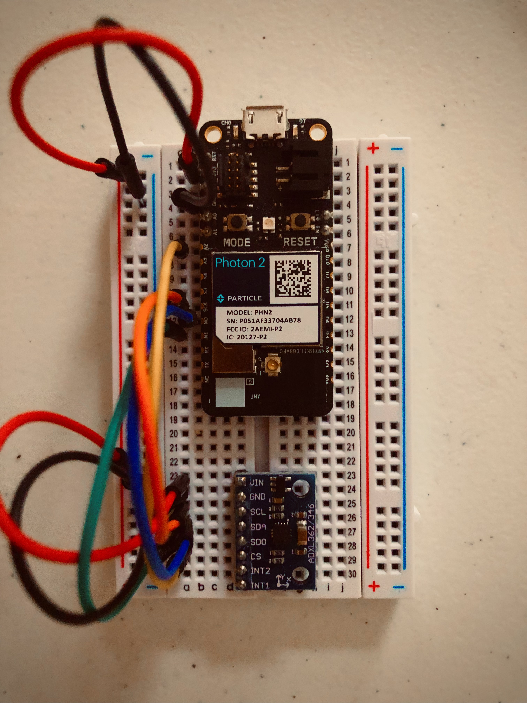
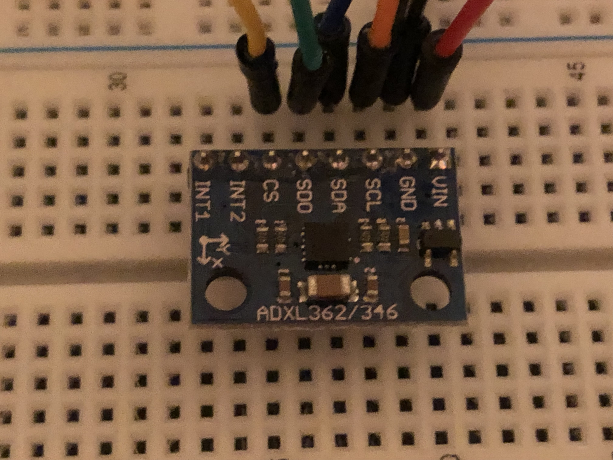

# IoT Event Streamer

---

## Overview

An _IoT Event Streamer_ for microcontroller sensor data. This project is a simple example of how to stream sensor data from a microcontroller, via `HTTP`, to an `HTTPS` webserver located on the internet. The data is then pushed to a client on the live server via SSE (server-sent events). Uses HTML & JavaScript to display the data.

The project is divided into parts: the C++ firmware for the Photon 2 microcontroller, the MicroPython firmware for the ESP32, two different Node.js servers (local/live) and a simple HTML page with JavaScript to display the sensor data.

`Server #1` is ran locally, on your LAN. It's a Node/Express server and takes `POST` requests from the _microcontrollers_, processes the sensor data and then makes another POST request to `Server #2` located on an HTTPS encrypted webserver.

`Server #2` hase two endpoints, `/sensors` and `/accelerometer`, where it recieves the sensor data. The server code also has a route with an `/events` endpoint that listens for sensor data and pushes it to the client via `SSE` where it's displayed.

Because the project is in its infancy, I have purposely slowed down the data stream to make it easier to see the data \*(see demo). I plan to change it to real-time once the project has matured a bit. But honestly, that isn't the focus of the project. The focus is really the entire process here. That is, what do you do if you have an IoT device that doesn't support `HTTPS` or have an `HTTPS` client library? How to get your sensor data "out" of your local area network and _into_ the internet so it can use `HTTPS`. No way would you want to send your sensor data out via `HTTP`, that's insecure. That's when I discovered (took me way longer than it should have) how powerful the standard HTTP methods (GET, POST) and a API really are in this case. For example, Axios HTTP client library takes care of a lot of error handling and has features like `Interceptors` that I was unaware of at the time. I am sure there is more than one way to do this (even a better way) but this proved to be the most rock solid and _secure_ way of doing it after trying several different methods. Also, why didn't I just use the C++ code to make a direct call to the live server instead and skip the local server? In my opinion, the local Express.js server code possibly adds an extra layer of security by providing validation, additional data processing and error checking that the C++ library probably did _not_ have...

In ways, this project is a culmination of all that I've learned over the last 1-2 years (client, server and microcontroller programming all in one). This project has almost everything I'd like to learn _more_ about so I plan to improve it while I learn...there's still _lots_ to learn, improve, add...

---

\* Check out an inital "test run" of the project at: [https://jim3.xyz](https://jim3.xyz) At the moment it prints out values every few seconds so wait till the table populates when visiting. If you noticed a big difference between the axis values for the ADXL362 happening that's probably me or the cat moving it around. 🤣 ...still looking for a good use for the accelorometer...The other sensor has proved to be my favorite, the `BME680` environmental sensor. I used a MicroPython driver by user @robert-hh https://github.com/robert-hh/BME680-Micropython to get things working. It proved to be a good move as it literally works right out of the box. Only thing you need to do, if using I2C, is change the PIN numnbers. Without these libraries/drivers this project wouldn't even be possible so big thanks to the authors and the work they put into it.

## Usage

### Hardware connections

The ADXL362 uses the library by https://github.com/rickkas7/ADXL362DMA in SPI mode. The wonderful thing about this library is that you do not have to know about SPI or SPI programming to use it. The library takes care of all of that for you. The only thing you need to do is connect the ADXL362 to the Particle device as shown in the table below.

Note: Unless you are the type that _wants_ to do SPI programming [see datasheet below], be thankful for the library. :)

 

| Particle Device | Breakout | Color  |      Description       |
| :-------------: | :------: | :----: | :--------------------: |
|       3V3       |   VIN    |  Red   |     3.3V DC Power      |
|       GND       |   GND    | Black  |         Ground         |
|       CLK       |   SCL    | Orange |    SPI Clock (SCK)     |
|      MOSI       |   SDA    |  Blue  |     SPI Master Out     |
|      MISO       |   SDO    | Green  |     SPI Master In      |
|       A2        |    CS    | Yellow |    SPI Chip Select     |
|       n/c       |   INT2   |        | Interrupt 2 (not used) |
|       n/c       |   INT1   |        | Interrupt 1 (not used) |

The BME680 uses the [Micropython Driver for a BME680 breakout](https://github.com/robert-hh/BME680-Micropython) I2C mode is used with this sensor. The only thing you need to do is connect the BME680 to the ESP32 as shown in the table below.

| ESP32 | Breakout | Color  | Description |
| :---: | :------: | :----: | :---------: |
| 3.3V  |   VIN    |  Red   |   3.3V DC   |
|  GND  |   GND    | Black  |   Ground    |
|  SCL  |   SCL    | Orange |   I2C SCL   |
|  SDA  |   SDA    |  Blue  |   I2C SDA   |

### Tech Stack

-   C++ (firmware)
-   MicroPython (firmware)
-   Node.js (server) / Express.js
-   HTML, JavaScript (client) / SSE (server-sent events)
-   ADXL362 (accelerometer)
-   BME680 (environmental sensor)
-   Particle Photon 2 (microcontroller)
-   ESP32 (microcontroller)

---

## Installation

`....`
