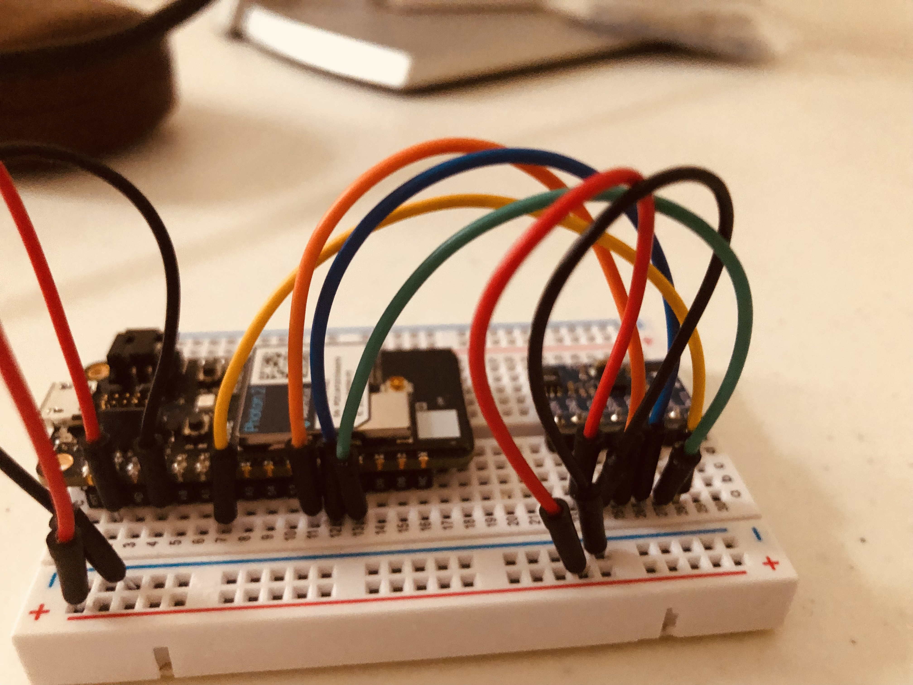

# IoT Event Streamer

---

## Overview

An _IoT Event Streamer_ for microcontroller sensor data. This project is a simple example of how to stream sensor data from a microcontroller, via `HTTP`, to an `HTTPS` webserver located on the internet. The data is then pushed to a client on the live server via SSE (server-sent events). Uses HTML & JavaScript to display the data.

The project is divided into parts: the C++ firmware for the Photon 2 microcontroller, the MicroPython firmware for the ESP32, two different Node.js servers (local/live) and a simple HTML page with JavaScript to display the sensor data.

`Server #1` is ran locally. It's a Node/Express server and takes `POST` requests from the _microcontrollers_, processes the sensor data and then makes another POST request to `Server #2` located on an HTTPS encrypted webserver.

`Server #2` has two endpoints, `/sensors` and `/accelerometer`, where it recieves the sensor data. The server code also has a route with an `/events` endpoint that listens for sensor data and pushes it to the client via `SSE` where it's displayed.

---

## Usage

### Hardware connections

The ADXL362 uses the library by https://github.com/rickkas7/ADXL362DMA in SPI mode. The wonderful thing about this library is that you do not have to know about SPI or SPI programming to use it. The library takes care of all of that for you. The only thing you need to do is connect the ADXL362 to the Particle device as shown in the table below.

Note: Unless you are the type that _wants_ to do SPI programming [see datasheet below], be thankful for the library. :)

 

| Particle Device | Breakout | Color  |      Description       |
| :-------------: | :------: | :----: | :--------------------: |
|       3V3       |   VIN    |  Red   |     3.3V DC Power      |
|       GND       |   GND    | Black  |         Ground         |
|       CLK       |   SCL    | Orange |    SPI Clock (SCK)     |
|      MOSI       |   SDA    |  Blue  |     SPI Master Out     |
|      MISO       |   SDO    | Green  |     SPI Master In      |
|       A2        |    CS    | Yellow |    SPI Chip Select     |
|       n/c       |   INT2   |        | Interrupt 2 (not used) |
|       n/c       |   INT1   |        | Interrupt 1 (not used) |

The BME680 uses the C++ [Adafruit BME680](https://github.com/kaga/Adafruit_BME680) library (for the Particle Photon) via I2C.

 

| ESP32 | Breakout | Color  | Description |
| :---: | :------: | :----: | :---------: |
| 3.3V  |   VIN    |  Red   |   3.3V DC   |
|  GND  |   GND    | Black  |   Ground    |
|  D1  |   SCK     | Yellow |   I2C       |
|  D0  |   MOSI    |  Blue  |   I2C       |

### Hardware/Software Used

-   C++ (firmware)
-   Node.js / Express.js
-   HTML/CSS & JavaScript
-   BME680 environmental sensor
-   ADXL362 accelerometer
-   Particle Photon 2 microcontroller

---

## Installation

`....`

---

*Note: There is a working demo of the project that illustrates the app at: [https://jim3.xyz](https://jim3.xyz) *note: not guaranteed to be up and running at all times* 

